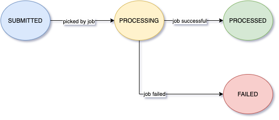

# state-machine
This library is a simple implementation of Finite State Machine in java. To use this, you just need to define your stateTransitions for your use case and the corresponding Transition handler and you are good to go.

##How to use

###Sample state machine
We will consider a sample state machine which depicts a File lifecycle which has been submitted for processing

   

#### 1. Add dependency
Add below maven dependency to your pom.xml

    <dependency>
        <groupId>com.fsm</groupId>
        <artifactId>finite-state-machine</artifactId>
    </dependency>

Alternatively, add below gradle dependency to your build.gradle

    compile group: 'com.fsm', name: 'finite-state-machine'

#### 2. Define states
Define the FileState enum extending State of fsm library

    public enum FileState implements State {
        SUBMITTED,
        PROCESSING,
        PROCESSED,
        FAILED;
    }

#### 3. Define events
Define the FileEvent extending Event of fsm library

    public enum FileEvent implements Event {
        PICK_FOR_PROCESSING,
        PROCESSING_SUCCESSFUL,
        PROCESSING_FAILURE;
    }

#### 4. Define Context
Context will be passed between the state transitions. This will be available for Transition handler. If your use case demands passing some data while transitioning, extend the Context class provided by library

    public class FileContext extends Context {
    
        @Getter
        private final FileRequest fileRequest;
    
        public FileContext(FileRequest fileRequest, FileState fromState, FileEvent event) {
            super(fromState, null, event);
            this.fileRequest = fileRequest;
        }
    }

#### 5. Define OnTransition handler
Transition handler lets you take any action during the course of state tranition. This will be invoked in the same transition, thus any failure occurring during handling will revert the state transition as well

    public class OnFileTransition implements EventAction<FileContext> {
    
        private final FileRepository fileRepository;
    
        @Override
        public void call(final FileContext fileContext) {
            FileRequest fileRequest = fileContext.getFileRequest();
            FileState toState = (FileState) fileContext.getTo();
            FileEvent event = (FileEvent) fileContext.getEvent();
            log.info("On transition event fired for file id {} and event {}", fileRequest.getId(), event);
    
            switch (event) {
                case PICK_FOR_PROCESSING:
                    //Your code goes here
                    updateFileState(fileRequest, toState);
                    break;
                case PROCESSING_SUCCESSFUL:
                    //Your code goes here
                    updateFileState(fileRequest, toState);
                    break;
                case PROCESSING_FAILURE:
                    //Your code goes here
                    updateFileState(fileRequest, toState);
                    break;
                default:
                    break;
            }
        }
    
        private void updateFileState(FileRequest fileRequest, FileState toState) {
            fileRequest.setState(toState);
            fileRepository.save(fileRequest);
        }
    }

#### 6. Initialize state machine
This will define all the allowed transitions and attach an OnTransition handler

    public class FileTransitionEngine {
    
        private final StateMachine<Context> fileStateMachine;
    
        /**
         * Define transitions and initialise state machine
         */
        private FileTransitionEngine() {
            this.fileStateMachine = MachineBuilder.start(FileState.SUBMITTED)
                    .addTransition(FileEvent.PICK_FOR_PROCESSING, FileState.SUBMITTED, FileState.PROCESSING)
                    .addTransition(FileEvent.PROCESSING_SUCCESSFUL, FileState.PROCESSING, FileState.PROCESSED)
                    .addTransition(FileEvent.PROCESSING_FAILURE, FileState.PROCESSING, FileState.FAILED)
                    .end(Sets.newHashSet(FileState.PROCESSED, FileState.FAILED)); //Terminal states
        }
    
        /**
         * Register transition handler
         * @param onFileTransition
         */
        public FileTransitionEngine(final OnFileTransition onFileTransition) {
            this();
            this.fileStateMachine.onTransition(onFileTransition);
        }
    
        /**
         * This method cam be invoked to fire transition
         * @param context
         */
        public void fireTransition(final FileContext context) {
            FileEvent event = (FileEvent) context.getEvent();
            this.fileStateMachine.fire(event, context);
        }
    
        /**
         * From any given state this method will give all the possible transitions permissible
         * @param fromState
         * @return
         */
        public Set<Transition> getTransitions(final FileState fromState) {
            return this.fileStateMachine.getAllowedTransitions(fromState);
        }
    }